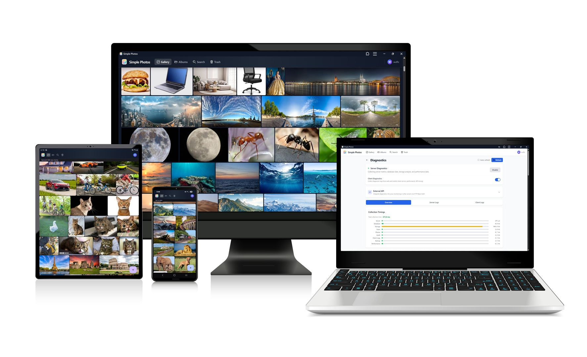

# Simple Photos

A self-hosted photo & video library with end-to-end encryption, multi-server backup & restore, and web + Android access.



### Authors Note
Simple Photos was born out of a desire for a secure, private, and user-friendly photo management solution that I could host myself. But found that other solutions lacked one critical thing, backup servers! Forcing users to choose between only having one backup target, or use multiple solutions; So I decided to build something from the ground up that met all my needs — and hopefully yours too!

## Features

### Core

- **Self-hosted** — runs on your own server, your data stays yours
- **End-to-end encryption** — always-on AES-256-GCM encryption with client-side key management, so only you can access your photos. Even if the server is compromised, your data remains secure.
- **Multi-user** — multiple accounts with per-user storage, shared albums, and admin controls
- **Themes** — full light/dark theme support
- **Google Cast Support** — cast photos and videos to compatible devices
- **Face and object recognition** — optional local AI module for face clustering and object tagging.  
- **Metadata editing** — view and edit photo metadata (EXIF, IPTC, XMP) with support for custom metadata fields
- **Geolocation support** — optional reverse geocoding to country/city. With OPT-IN 3rd party precise location via OSM & Photon
- **Geolocation Stripping** — option to remove geolocation metadata during import for privacy
- **GPU acceleration** — optional NVIDIA GPU-accelerated media processing and AI inference for faster performance on supported hardware
- **PWA** -  Progessive Web App to install on devices for easier access. 

### Media
- **Supported Photo, video, and audio formats** — JPEG, PNG, GIF, WebP, AVIF, BMP, MP4, WebM, MP3, FLAC, OGG, WAV
- **Media conversion** — automatic FFmpeg-based conversion of non-native formats (I.E HEIC → JPEG, MKV → MP4, WMA → MP3) during import and scan
- **Photo/Video/Audio editing** — crop, rotate, adjust brightness, and trim videos/audio using non-destructive edits stored as metadata or rendered into a saved copy.  
- **Android Motion Photos support** — view and manage Motion Photos, with future support for apple's Live Photos planned
- **Panoramic photos** — 360° panoramic photo viewer 
- **HDR support** — view and manage HDR photos and videos
- **Burst photo support** — view and manage burst photo sequences as grouped albums
- **Slideshows! WOW!*** - view photos as slideshows with optional shuffle

### Organization

- **Albums** — organize photos into albums with optional sharing between users
- **Secure Galleries** — password-protected encrypted galleries for sensitive content, with support for multiple albums
- **Smart albums** — dynamic albums based on people, places, and things (optional modules required)
- **Trash** — 30-day soft-delete with restore
- **Tags & search** — tag photos and search across your library
- **Favorites** — mark and filter favorite photos
- **Import** — drag-and-drop upload with Google Photos (Google Takeout) Support
- **Library export** — download your entire library as a ZIP archive

### Backup & Sync

- **Backup sync** — automatic server-to-server backup replication with support for multiple backup targets, including remote servers
- **Backup recovery** — restore a primary server from any backup server with full data integrity (photos, albums, secure galleries, trash, metadata, accounts, etc.)
- **Offsite Backup Support** - Ability to host from a VPS or other similar services

### Security

- **2FA** — TOTP two-factor authentication with backup codes
- **Rate limiting** — brute-force protection on authentication endpoints
- **Audit logging** — server-side audit trail
- **TLS/SSL** — native HTTPS support with configurable certificates, supporting multiple methods

### Android

- **Android app** — view and manage your library
- **Automatic backup** — background photo backup from your device
- **Server discovery** — automatic network scanning to find your server during setup

## Tech Stack

| Component | Technology |
|-----------|------------|
| Server    | Rust, Axum, SQLite (sqlx), FFmpeg |
| Web       | React, TypeScript, Vite, Tailwind CSS, Zustand, Dexie (IndexedDB) |
| Android   | Kotlin, Jetpack Compose, Hilt, Room, WorkManager |

## Getting Started

### Pre-built installers (recommended)

Download the latest installer from the [Releases page](https://github.com/Wulfic/simple-photos/releases)

### Build from source

The install scripts handle everything — building the server, web frontend, and (optionally) the Android APK. They support both Docker and bare-metal (native) installations.

### CLI Flags

```
--mode <native|docker>  Installation mode
--name <string>         Instance name (for Docker containers)
--no-build-android      Skip Android APK build prompt
--no-start              Don't start the server after install
--yes                   Auto-accept all prompts
--help                  Show this help
```

**Examples:(Run as Root/Admin)**

```bash
# Native install
./install.sh --mode native 

# Docker install
./install.sh --mode docker

# Native uninstall
./install.sh --uninstall native

# Docker uninstall
./install.sh --uninstall docker
```

```powershell
# Native install
.\install.ps1 -Mode native 

# Docker install
.\install.ps1 -Mode docker

# Native uninstall
.\install.ps1 -Uninstall native

# Docker uninstall
.\install.ps1 -Uninstall docker
```

### Prerequisites

- **Rust** (for native builds)
- **Node.js** (for building the web frontend)
- **Docker** (for Docker-mode installs)
- **FFmpeg** (required for media conversion, video thumbnails, and rendering)
- **Android SDK** (optional, for building the Android APK)

All prerequisites are handled automatically by the install scripts, minus docker installation on Windows (which requires manual setup).

## API

See [API_REFERENCE.md](API_REFERENCE.md) for the full REST API documentation.


## Credits

- **Icons** — Custom icon set by [Angus_87](https://www.flaticon.com/authors/angus-87) on Flaticon
- **Developed by** WulfNet Designs

## Source Code

[GitHub Repository](https://github.com/wulfic/simple-photos)

## Documentation

Full developer documentation lives in the project [Wiki](https://github.com/Wulfic/simple-photos/wiki):

- [API Reference](https://github.com/Wulfic/simple-photos/wiki/API-Reference)
- [Build & Packaging](https://github.com/Wulfic/simple-photos/wiki/Build-and-Packaging)
- [Testing](https://github.com/Wulfic/simple-photos/wiki/Testing)

## Contributing

This repo uses two long-lived branches:

- **`main`** — lean release branch. Only what's needed to build & ship.
- **`dev`** — full development branch with tests, agent customisation, and
  scratch artefacts. Open all pull requests against `dev`. Pushing a version
  tag (`vX.Y.Z`) runs the full release pipeline, and on success mirrors
  `dev` → `main` after stripping development-only paths
  (see `.github/sync-main-exclude.txt` on `dev`).

## License

This project is licensed under the [MIT License](LICENSE).

© 2026 WulfNet Designs — [github.com/Wulfic/simple-photos](https://github.com/Wulfic/simple-photos)

Attribution is required when redistributing or using this software. Please retain the original copyright notice and link to the source repository.
